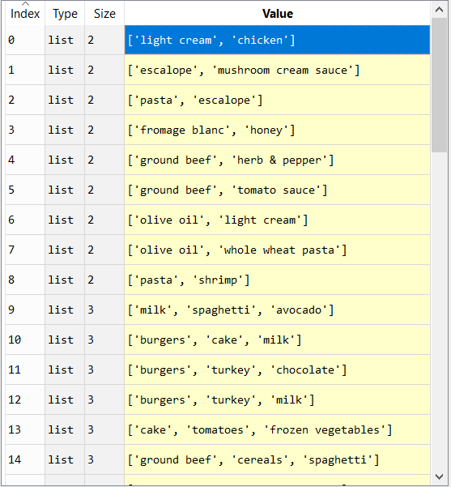

# Apriori
Using the Apriori algorithm to extract some usefull combinations of products therefore optimizing the sales of the glossary store

Using association rule, we allowed the glossary to know exactely where to place its products in the store in order to maximize profit.

For instance If a product A can be very well associated to a product B and the person who bought A may not even think  of the association between A and B if we place A closer to B ==> The association can pop-up to the buyer mind and buy the 2 products and it can be done applied for a large number of products.

for example: If some one buy some chicken, the same person is highly likely to buy light cream as well ==> by placing the 2 closer to each other the buyer is highly likely to buy the 2 products even if he was intended to only buy chicken as we've found it after our analysis using the apriori algorithm as can be seen in the picture below.

 
 
